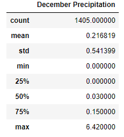

# Surfs_up

## Overview of Project

The client W. Avery has asked for information regarding weather trends in Oahu, specifically for the months of June and December. This analysis will be used to determine if his dream of opening up a surf and ice cream shop business can be sustainable year-round. 

## Results

- June's average temperature is 75 degrees, December's average temperature is 71 degrees. This bodes well for maintaining the business year round. 
- There are 1700 data points taken for June and 1517 data points for December. Averaging the monthly data points of June and December together, there were 54 data points taken per day. That suggests plenty of data to conclude that the monthly temperatures are accurate. 
- The lowest temperature recorded was in December at 56 degrees. However, December's lowest quartile is 69 degrees suggesting that the record low temperature is an outlier possibly even recorded at night time during off business hours. 

## Summary: 

The analysis concludes that the temperatures of Oahu are ideal to open up a surf and ice cream shop and to operate year round. The temperature differences of the opposite winter and summer months are determined to be negligible by sharing simliar average, max, min, and standard deviation indexes. 

Additionally, the analysis shows that rain will hardly be an issue in Oahu:

The precipitation summaries for each month are quite similiar. An important factor to note is that the average upper quartile for the months of June and December is 0.135. This suggests rain is very infrequent in Oahu. Just like the lowest recorded temperature in December, further analysis could prove that rare precipitation comes at off hours of the business. 

